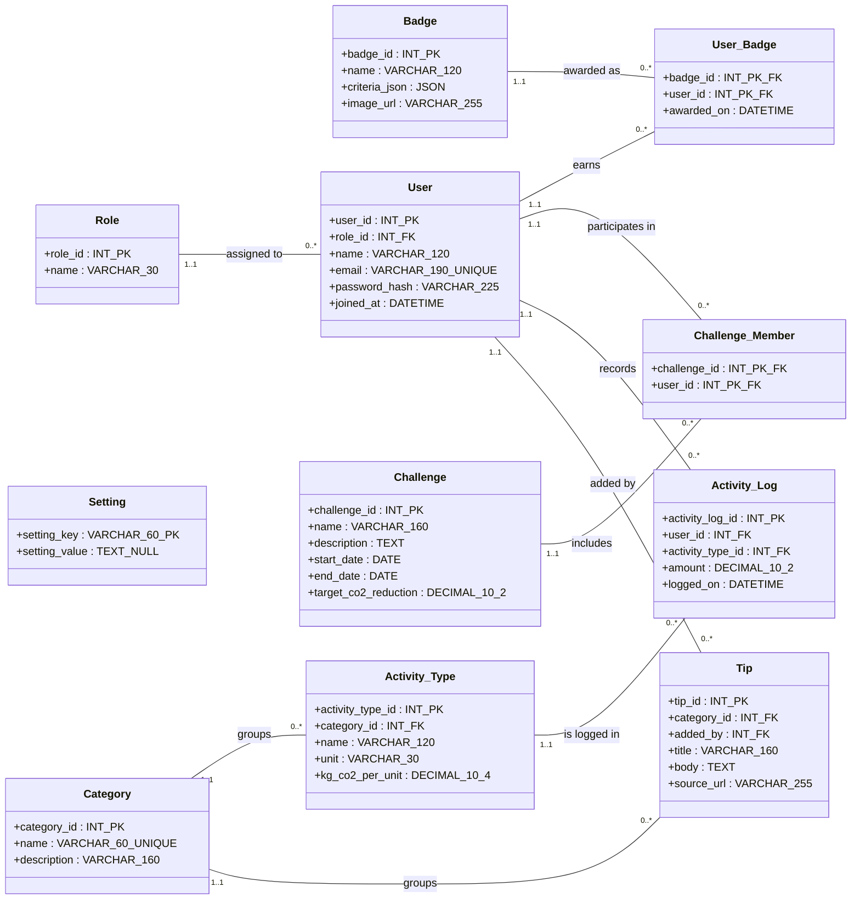

# 🌱 GreenStep

**Small daily steps. Measurable climate impact.**

A personal carbon footprint & eco-lifestyle tracker — a cross-platform system built with **Vue 3** (frontend) and **PHP Slim 4** (backend REST API), backed by **MySQL 8**. Users log daily transport, energy, food, and recycling activities; the server computes CO₂ impact against DEFRA/IPCC-sourced emission factors, and drives streaks, badges, and community challenges.

Built for **SCSM2223 – Cross-Platform Application Development**, Universiti Teknologi Malaysia, Faculty of Computing.

---

## Table of Contents

- [Tech Stack](#tech-stack)
- [Features](#features)
- [System Architecture](#system-architecture)
- [Entity Relationship Diagram](#entity-relationship-diagram)
- [Project Structure](#project-structure)
- [Security](#security)
- [Deployment Guide](#deployment-guide)
- [Mobile Deployment Guide](#mobile-deployment-guide)
- [Test Credentials](#test-credentials)
- [Team](#team)

---

## Tech Stack

| Layer | Technology |
|---|---|
| Frontend | Vue 3 (Composition API), Vue Router 5, Pinia 3, Vite 8 |
| Mobile | Capacitor (Android APK) |
| Backend / API | PHP 8.1, Slim 4 (RESTful micro-framework) |
| Auth | JWT (HS256), bcrypt password hashing |
| Database | MySQL 8, accessed via PDO (prepared statements) |
| Hosting | Netlify (frontend), Render (backend API), Google Cloud SQL (database) |
| Tooling | GitHub, Composer, npm/Vite, Postman, HeidiSQL, Laragon |

---

## Features

- **Multi-role secure access** — `user`, `leader`, `admin`, enforced via stateless JWT + role-gated middleware. The leader is currently the same as user but would be enhanced in future sprints.
- **Daily activity logging** — full CRUD across transport, energy, food, and recycling categories.
- **Server-side CO₂ engine** — `CO₂ (kg) = amount × kg_co2_per_unit`, computed entirely server-side from DB-driven emission factors (never trusted from the client, only the admin can configure them).
- **Interactive dashboard** — daily/weekly trends, streaks, category breakdowns.
- **Gamification** — badges awarded automatically from JSON-defined criteria (`total_logs`, `streak_days`, `category_logs`); community challenges with collective progress tracking.
- **Admin panel** — manage users (roles/status), emission factors, eco-tips, badges, challenges, and platform-wide settings (branding, maintenance mode, password policy).
- **Cross-platform** — single Vue 3 codebase, deployed to web and wrapped as a native Android app via Capacitor.

---

## System Architecture

```
┌─────────────────────────────┐
│           CLIENT             │
│  Web Browser  |  Android APK │
│   (Vue 3 SPA, Capacitor wrap)│
└──────────────┬───────────────┘
               │ HTTPS / JSON, Bearer JWT
┌──────────────▼───────────────┐
│      APPLICATION TIER        │
│      PHP Slim 4 REST API     │
│  Routes → Middleware →       │
│  9 Controllers → Support     │
│  (JwtAuthMiddleware, CORS,   │
│   BadgeEvaluator,            │
│   ChallengeProgress)         │
└──────────────┬───────────────┘
               │ PDO (prepared statements)
┌──────────────▼───────────────┐
│          DATA TIER           │
│     MySQL 8 · 11 tables      │
│   FK cascade / restrict      │
└───────────────────────────────┘
```

- **Frontend** is pure presentation — it never computes CO₂ values itself.
- **Backend** is a stateless, headless JSON API; all business logic and calculations live here.
- **Database** enforces referential integrity via foreign keys (`ON DELETE CASCADE`/`RESTRICT`).

---

## Entity Relationship Diagram

11 tables, fully normalized, with referential integrity enforced at the database level.


---

## Project Structure

```
GreenStep/
├── Backend/
│   ├── config/
│   │   └── settings.php          # DB + JWT configuration
│   ├── public/
│   │   └── index.php             # Front controller
│   ├── sql/
│   │   ├── schema.sql            # Table definitions
│   │   └── seed.sql              # Roles, categories, factors, demo accounts
│   ├── src/
│   │   ├── Controllers/          # 9 controllers
│   │   ├── Database/
│   │   ├── Middleware/           # JwtAuthMiddleware, CorsMiddleware
│   │   ├── Routes/
│   │   │   └── Api.php           # All route definitions
│   │   └── Support/              # BadgeEvaluator, ChallengeProgress, JsonResponse, etc.
│   └── composer.json
└── Frontend/
    ├── src/
    │   ├── views/                # User + Admin page components
    │   ├── components/           # Shared components (e.g. AdminSidebar)
    │   ├── router/                # Vue Router + role guards
    │   ├── stores/                # Pinia (auth store)
    │   ├── services/
    │   │   └── api.js            # Central fetch wrapper + endpoint functions
    │   └── assets/
    │       └── main.css
    ├── capacitor.config.ts
    └── package.json
```

---
# Routes

## Public (no auth)

| Method | Route | Description |
|---|---|---|
| GET | `/api/health` | Health check |
| POST | `/api/auth/register` | Register a new user (always assigned `user` role) |
| POST | `/api/auth/login` | Login → returns JWT + user object |
| GET | `/api/settings/public` | Site name + maintenance mode status (for login page) |

## Authenticated User

| Method | Route | Description |
|---|---|---|
| GET | `/api/activity-types` | List activity types + emission factors |
| GET | `/api/logs` | List current user's activity logs |
| POST | `/api/logs` | Create a log |
| PUT | `/api/logs/{id}` | Update a log |
| DELETE | `/api/logs/{id}` | Delete a log |
| GET | `/api/dashboard` | Personal dashboard: today/yesterday CO₂, weekly trend, streak, badges |
| GET | `/api/tips/daily` | Get today's eco-tip |
| GET | `/api/badges` | List all badges with earned/locked status |
| GET | `/api/challenges` | List all challenges with collective progress |
| GET | `/api/challenges/{id}` | Challenge detail + leaderboard |
| POST | `/api/challenges/{id}/join` | Join a challenge |

### Community Leader

| Method | Route | Description |
|---|---|---|
| POST | `/api/challenges` | Create a challenge |
| PUT | `/api/challenges/{id}` | Update a challenge |
| DELETE | `/api/challenges/{id}` | Delete a challenge |

(For future scalability for new role implementation!)

### Administrator

| Method | Route | Description |
|---|---|---|
| POST | `/api/admin/challenges` | Create a challenge (admin) |
| PUT | `/api/admin/challenges/{id}` | Update a challenge (admin) |
| DELETE | `/api/admin/challenges/{id}` | Delete a challenge (admin) |
| POST | `/api/admin/badges` | Create a badge |
| DELETE | `/api/admin/badges/{id}` | Delete a badge |
| POST | `/api/admin/tips` | Publish a new eco-tip |
| GET | `/api/admin/factors` | List all emission factors |
| PUT | `/api/admin/factors/{id}` | Update an emission factor |
| GET | `/api/admin/stats` | Platform-wide stats (users, logs, challenges, badges) |
| GET | `/api/admin/users` | List all users |
| PUT | `/api/admin/users/{id}/role` | Change a user's role |
| PUT | `/api/admin/users/{id}/status` | Activate/deactivate a user |
| DELETE | `/api/admin/users/{id}` | Delete a user (blocked if they have existing data) |
| GET | `/api/admin/settings` | Get platform settings |
| PUT | `/api/admin/settings` | Update platform settings |

**Role hierarchy:** Admin ⊇ Leader = User ⊇ Public. Missing/expired token → `401`. Wrong role → `403`.

**Total: 33 endpoints across 9 controllers.**

---

## Security

### Overview

This section documents the security mechanisms, cryptographic standards, and access control policies implemented in the GreenStep API. Maintained by the Database & Security Lead.

### Authentication & Cryptography

The API is entirely stateless and enforces the following cryptographic standards:

- **Password Hashing:** Passwords are never stored in plaintext. GreenStep uses PHP's native `password_hash()` with `PASSWORD_DEFAULT` (currently Bcrypt). Passwords are verified via time-safe `password_verify()` checks to prevent timing attacks.
- **Tokenization (JWT):** Upon successful authentication, the server issues a JSON Web Token signed with **HS256** (HMAC-SHA256).
- **Token Payload:** The JWT strictly contains the Issuer (`iss`), Issued At (`iat`), Expiration (`exp`, 1-hour TTL), User ID (`sub`), and User Role (`role`). No sensitive PII is exposed in the token payload.
- **Account lifecycle:** every user has an `is_active` flag. Deactivated accounts are rejected at login with a `403`, independent of whether their credentials are correct.
- **Maintenance mode:** a platform-wide `Setting` can restrict login to Admin accounts only; all other logins are rejected with a `503` and a clear message while it's enabled.
- **Password policy:** minimum length and character-class requirements (uppercase, numeric) are configurable at runtime via the `Setting` table and enforced server-side on registration — not hardcoded, so admins can tighten or relax policy without a deployment.

### Threat Mitigation Strategies

- **SQL Injection (SQLi):** The database connection strictly enforces `PDO::ATTR_EMULATE_PREPARES => false`. Every database transaction uses parameterized statements; user input is never concatenated directly into SQL strings.
- **User Enumeration:** Failed login attempts return a generic `401 Unauthorized` for both a wrong email and a wrong password — the system never reveals which factor was incorrect.
- **Cross-Origin Resource Sharing (CORS):** A dedicated `CorsMiddleware` answers preflight `OPTIONS` requests and enforces allowed origins/headers, letting the decoupled Vue 3 frontend securely consume the API from its own origin.
- **Referential integrity:** all foreign keys declare `ON DELETE CASCADE` or `RESTRICT` as appropriate — e.g. deleting a user cascades their badges/challenge memberships, while deleting a `Role` still in use is restricted.
- **Self-modification guard:** an admin cannot change their own role, deactivate, or delete their own account via the Users management endpoints — prevents accidental lockout and enforces four-eyes on admin account changes.
- **Safe user deletion:** `DELETE /api/admin/users/{id}` is blocked with a `409` if the target user has existing activity logs, badges, or challenge memberships — administrators must deactivate rather than delete users with historical data, preserving audit trail integrity.

### Role-Based Access Control (RBAC)

The API uses a layered middleware architecture (`JwtAuthMiddleware`) to enforce authorization based on the `role` claim in the JWT. Each protected route explicitly declares its minimum required role (e.g. `new JwtAuthMiddleware($jwt, 'admin')`). Missing/expired token → `401`; valid token but wrong role → `403`.

| Role | Scope |
|---|---|
| **Public** | `/api/health`, register, login, public site settings (site name, maintenance status) |
| **User**, **Leader** | All Public access, plus: manage own Activity Logs (full CRUD), view personal dashboard, earn badges, view/join Challenges, view daily tips |
| **Leader** (in future sprint) | All User access, plus: create, update, and delete Community Challenges |
| **Admin** | All access, plus: manage Users (list, change role, activate/deactivate, delete with safeguards), manage Emission Factors, curate the Eco-Tip library, manage Badges (create/delete), manage Challenges (admin-scoped create/update/delete), view platform-wide statistics, and configure platform Settings (branding, maintenance mode, password policy) |

**Inheritance:** Admin ⊇ Leader = User ⊇ Public.

### Reporting a Vulnerability

If you discover a security vulnerability within GreenStep, please open a private issue or contact the Database & Security Lead directly. Please do not disclose vulnerabilities publicly until a patch has been released.

---

## Deployment Guide

GreenStep deploys as three independently hosted tiers, all on free tiers.

### Frontend → Netlify

1. Push to `main` (or your release branch) on GitHub.
2. In Netlify: **New site from Git** → select the repository.
3. Build settings:
   - Base directory: `Frontend`
   - Build command: `npm run build`
   - Publish directory: `Frontend/dist`
4. Add an environment variable for your API base URL if your `api.js` is adapted to read from `import.meta.env` (recommended for production instead of hardcoding).
5. Netlify auto-rebuilds on every push to the connected branch.

### Backend → Render

1. In Render: **New Web Service** → connect the repository, root directory `Backend`.
2. Runtime: PHP.
3. Build command: `composer install --no-dev --optimize-autoloader`
4. Start command (adjust to your entry point): `php -S 0.0.0.0:$PORT -t public`
5. Set environment variables for DB connection and JWT secret (matching your `config/settings.php` structure) in Render's dashboard rather than committing them.
6. Confirm CORS in `CorsMiddleware.php` allows your Netlify frontend origin.

### Database → Google Cloud SQL

1. Create a MySQL 8 instance on Google Cloud SQL.
2. Run `schema.sql` then `seed.sql` against it (via Cloud SQL Proxy, HeidiSQL, or the Cloud Console's built-in query tool).
3. Update your Render backend's DB environment variables to point at the Cloud SQL instance's connection string, user, and password.
4. Ensure Cloud SQL's authorized networks/IP allowlist includes Render's outbound IP range (or use the Cloud SQL Auth Proxy for a private connection).

### Deployment Diagram

```
GitHub (source of truth)
   │ push → main / release branch
   ├──deploy──▶ Netlify  (Vue 3 static build, CDN, HTTPS)
   ├──deploy──▶ Render   (PHP 8.1 · Slim 4 API, HTTPS, JWT middleware)
   │
Netlify ──HTTPS/JSON──▶ Render ──PDO──▶ Google Cloud SQL (MySQL 8, port 3306)
```

---

## Mobile Deployment Guide

GreenStep ships to Android as a **Capacitor wrapper around the live public frontend URL** (not a locally bundled build) — the native app essentially loads your deployed Netlify site inside a native shell, giving you app-store packaging without a separate mobile codebase.

### Prerequisites

- Node.js 20+ and npm (already required for the frontend)
- **Android Studio** (latest stable — Hedgehog or newer recommended)
- **JDK 17** (bundled with recent Android Studio versions, or install separately)
- An Android SDK with:
  - **Minimum SDK: API 22** (Android 5.1) — Capacitor's default floor
  - **Target/Compile SDK:** latest stable (as prompted by Android Studio on project open)

### 1. Install Capacitor in the frontend project

```bash
cd Frontend
npm install @capacitor/core @capacitor/cli @capacitor/android
```

### 2. Initialize Capacitor (first time only)

```bash
npx cap init "GreenStep" "com.greenstep.app" --web-dir=dist
```

### 3. Configure Capacitor to load the live public URL

Edit `capacitor.config.ts`:

```typescript
import { CapacitorConfig } from '@capacitor/cli';

const config: CapacitorConfig = {
  appId: 'com.greenstep.app',
  appName: 'GreenStep',
  webDir: 'dist',
  server: {
    url: 'https://greenstepproject.netlify.app',
    cleartext: false
  }
};

export default config;
```

> Since `server.url` points at your live Netlify deployment, Capacitor does **not** need a fresh local `dist/` build to function correctly in this mode — the app fetches live content at runtime. Still run a build once so the `dist/` folder exists for the initial `cap add` step.

### 4. Add the Android platform

```bash
npm run build
npx cap add android
```

### 5. Sync changes into the native project

Run this any time you update `capacitor.config.ts` or install new Capacitor plugins:

```bash
npx cap sync android
```

### 6. Open in Android Studio

```bash
npx cap open android
```

### 7. Build the APK (done by our team. Refer to the demo video attached with the slides in e-learning!)

In Android Studio:

1. Let Gradle sync complete (may prompt to update SDK/build tools — accept).
2. **Build → Build Bundle(s) / APK(s) → Build APK(s)**
3. Locate the output APK under `android/app/build/outputs/apk/debug/app-debug.apk`
4. Install on a device/emulator via `adb install app-debug.apk`, or open directly in the Android Studio emulator with the Run ▶ button.

### Notes

- Because this app wraps a live URL, **the backend (Render) must also be publicly reachable** — if the API is still on `localhost`, the mobile app (and the public frontend) will fail every request that isn't purely static. Confirm your production `api.js` `API_BASE_URL` points at your live Render URL, not `localhost:8080`.
- For a Play Store release build (signed AAB) rather than a debug APK, use **Build → Generate Signed Bundle / APK** and follow Android Studio's signing key wizard.

---

## Test Credentials

All accounts are provisioned by `seed.sql` — run it against your target database before testing.

| Role | Email | Password |
|---|---|---|
| User | `member@greenstep.com` | `password` |
| Leader | `leader@greenstep.com` | `password` |
| Admin | `admin50@greenstep.com` | `Password123` |

**Live frontend:** https://greenstepproject.netlify.app/

---

## Team

**Group RM2Z · Section 02 · SCSM2223 Cross-Platform Application Development**
Lecturer: Dr. Hishammuddin B. Asmuni

| Name | Matric No. | Role |
|---|---|---|
| Zeng Liting | A24CS4073 | Frontend Lead — Vue 3 SPA, Router & Pinia, mobile-first views |
| Mohammed Mohsen Alsakkaf | A23CS4026 | Backend & API Lead — Slim 4 API, controllers, JWT middleware, CO₂/badge engines |
| Rawan Mohamed Salih Magzob | A24CS4066 | Database & Security Lead — schema/ER model, hardened PDO, RBAC, threat model |
| Zineb Ennabili | A24CS4057 | DevOps, Mobile & Integration — deployment, Capacitor Android wrap, integration testing |

**Repository:** https://github.com/ennabilizineb/GreenStep
